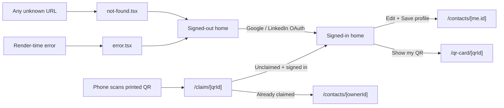
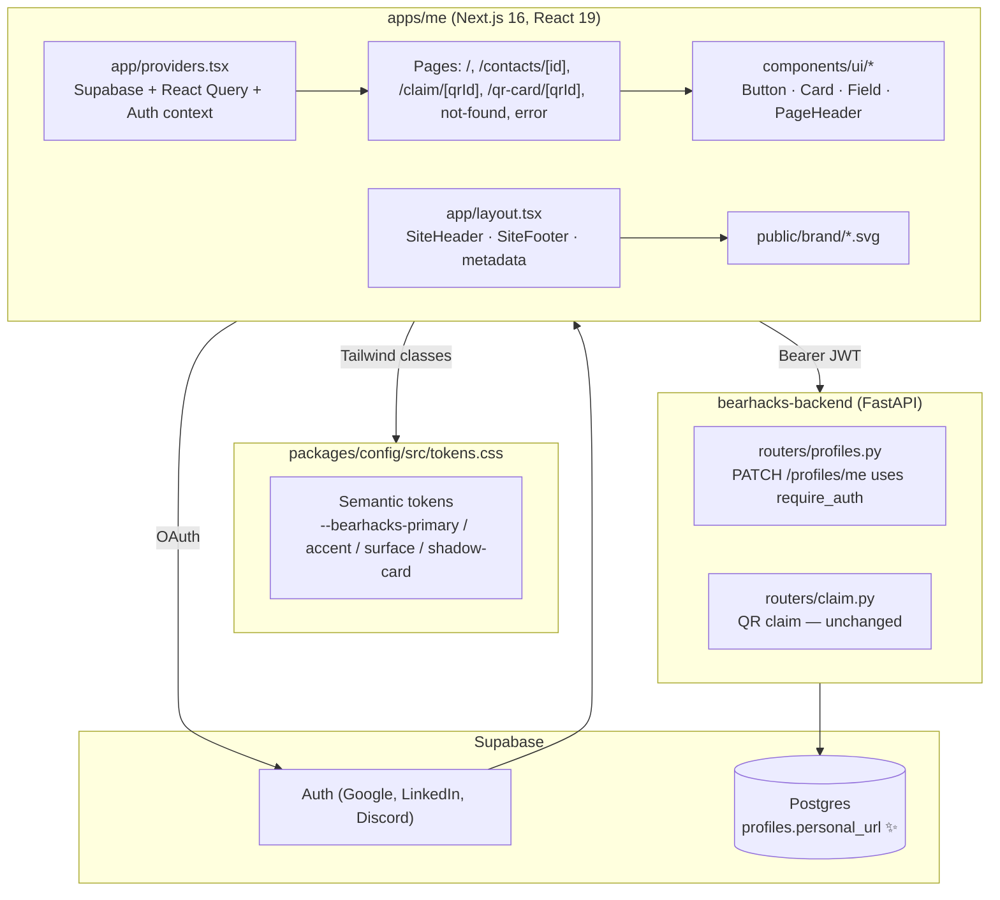
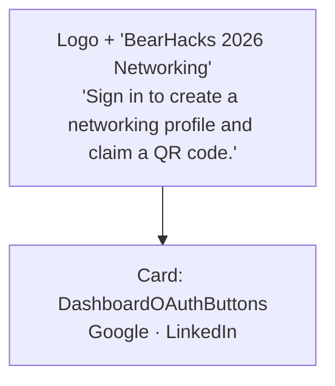

# BearHacks 2026 — `apps/me` Production Polish

> Change record for the participant portal upgrade from PoC to production.
> Date: 2026-04-18.
> Source plan: `me-portal-production-polish_0f02d1ad`.
> Source requirements: dev-team Discord chat (Aleks, Jon, Vega, Yves).
> Sister doc: [apps/admin/docs/PRODUCTION_POLISH.md](../../admin/docs/PRODUCTION_POLISH.md) — the matching staff-portal changelog.

---

## 1. Summary

The participant portal (`bearhacks-web/apps/me`) was lifted from a developer-facing
PoC into a production-ready event experience. Three things changed at once:

1. **Surface area shrank.** Wallet flows, scan/favourite debug forms, the Discord
   join CTA, and the “Signed in as `<email>` via OAuth” debug strip were removed.
2. **Brand identity arrived.** The portal now matches the `bearhacks-frontend/2026`
   palette and logo set, with shared `Card`, `Button`, `Field`, `PageHeader`,
   `SiteHeader`, and `SiteFooter` primitives wired to design tokens.
3. **Access policy flipped.** Profile creation no longer requires being on the
   accepted-hacker allowlist — anyone with a Google or LinkedIn login can build a
   profile. The lanyard check moved to the in-person QR claim table.

A new optional `personal_url` (portfolio link) field flows end-to-end from the
Postgres column through the API model and into both the home editor and the
claim form. After saving, users are redirected to `/contacts/{userId}` so they
land on a dedicated profile page (Aleks's #1 complaint).

---

## 2. End-to-end flow



---

## 3. Architecture: new layered stack



---

## 4. Backend changes (`bearhacks-backend`)

### 4.1 Auth gate dropped on `PATCH /profiles/me`

Replaced `Depends(require_accepted_hacker)` with `Depends(require_auth)` so any
signed-in Supabase user can upsert their own profile row. The lanyard check now
lives at the in-person QR claim table; `/claim/{qrId}` keeps its existing
gating.

```python
# routers/profiles.py (excerpt)
@router.patch("/me")
async def update_my_profile(
    body: ProfileUpdate,
    payload: dict = Depends(require_auth),
    _: None = rate_limit_dependency(WRITE_POLICY, "profiles-write"),
):
    ...
```

### 4.2 `personal_url` end-to-end

Schema migration applied via the Supabase MCP server (`apply_migration`) and
mirrored into the repo at
`bearhacks-backend/supabase/migrations/20260418120000_add_profiles_personal_url.sql`:

```sql
alter table profiles add column if not exists personal_url text;
```

Pydantic model extension:

```python
class ProfileUpdate(BaseModel):
    display_name: Optional[str] = None
    bio: Optional[str] = None
    linkedin_url: Optional[str] = None
    github_url: Optional[str] = None
    personal_url: Optional[str] = None
    role: Optional[str] = None
```

Verified with Supabase MCP `execute_sql`:

```text
public.profiles columns:
id, qr_id, display_name, bio, linkedin_url, github_url, role, updated_at, personal_url
```

### 4.3 Module docstring

Updated `routers/profiles.py` header to document the relaxed access policy:

> `PATCH /profiles/me` — any authenticated Supabase user updates their own row
> (`sub`). No accepted-hacker gate: lanyard check at the QR-claim table is the
> in-person filter.

---

## 5. Design system

### 5.1 Tokens (`packages/config/src/tokens.css`)

Added semantic brand surfaces on top of the existing 2026 palette:

| Token                         | Value                                                              | Use                              |
| ----------------------------- | ------------------------------------------------------------------ | -------------------------------- |
| `--bearhacks-surface`         | `#ffffff`                                                          | Card background                  |
| `--bearhacks-surface-alt`     | `#f2f8ff`                                                          | Page background                  |
| `--bearhacks-primary`         | `#1d3264`                                                          | Headings, primary buttons        |
| `--bearhacks-primary-hover`   | `#3766d4`                                                          | Hover state on primary           |
| `--bearhacks-accent`          | `#f0a422`                                                          | CTA / "Show QR" buttons          |
| `--bearhacks-accent-soft`     | `#ffdc56`                                                          | Hover state on accent            |
| `--bearhacks-on-primary`      | `#ffffff`                                                          | Foreground on primary surfaces   |
| `--bearhacks-shadow-card`     | `0 1px 2px rgba(29,50,100,.06), 0 8px 24px rgba(29,50,100,.08)`    | Elevation on `Card`              |
| `--bearhacks-radius-lg`       | `0.75rem`                                                          | Card corners                     |

### 5.2 UI primitives (`apps/me/components/ui/`)

| File             | Exports                                       | Notes                                                     |
| ---------------- | --------------------------------------------- | --------------------------------------------------------- |
| `button.tsx`     | `Button` (`primary` / `secondary` / `ghost`)  | Honors `--bearhacks-touch-min`; primary uses brand blue.  |
| `card.tsx`       | `Card`, `CardHeader`, `CardTitle`, `CardDescription` | Token-driven border + shadow + radius.             |
| `field.tsx`      | `InputField`, `TextareaField`                 | Label + input/textarea + hint/error slot, `useId`-based.  |
| `page-header.tsx`| `PageHeader`                                  | Optional back arrow with `router.back()` fallback.        |

### 5.3 Brand assets

Copied into `apps/me/public/brand/`:

- `icon_black.svg` — favicon, in-card brand mark.
- `icon_white.svg` — header logo on dark-blue chrome.
- `logo_long.svg` — signed-out hero.

### 5.4 Layout chrome

`apps/me/components/site-header.tsx` and `site-footer.tsx` provide the
event-branded shell. The header uses dark-blue background with the white icon;
the footer is tiny, brand-neutral, and always pinned to the bottom of the
viewport thanks to `min-h-full flex flex-col`.

---

## 6. Page-by-page changes

### 6.1 `app/layout.tsx`

- `metadata.title = "BearHacks 2026 Networking"` plus description, `icons`, and
  `openGraph`.
- Wraps `{children}` in `<SiteHeader />` and `<SiteFooter />`.
- Body uses the new `--bearhacks-surface-alt` page background.

### 6.2 `app/page.tsx` (home — biggest rewrite)

**Signed-out state:**



- Removed the **Join BearHacks 2026 (Discord)** section.
- Removed the “After you sign in, we'll send you back to your link.” copy.

**Signed-in state:**

- Header: a small welcome row with **My profile** link + **Sign out** ghost button.
- **My profile** card with the new `personal_url` field.
- **My QR card** (only when `qr_id` exists) — links to `/qr-card/[qrId]`.
- Removed: wallet passes, wallet export, scan/favourite forms, scanned contacts
  list, favourites list, and the `Signed in as <email> via OAuth` debug strip.
- On save → `router.push('/contacts/' + userId)`.

### 6.3 `app/contacts/[id]/page.tsx`

- `<PageHeader>` with back arrow.
- Renders `personal_url` alongside LinkedIn / GitHub.
- Owner detection (`auth.user.id === profileId`) swaps **Favourite** for
  **Edit profile** (which routes back to `/`).
- Title flips to "My profile" when viewing yourself.

### 6.4 `app/claim/[qrId]/page.tsx`

- New copy: "Confirm your details to link this QR code to your account."
- `personal_url` added to the form (optional).
- Already-claimed state is now a branded `Card` with a "View profile →" CTA.
- Required fields kept: `display_name`, `role`.

### 6.5 `app/qr-card/[qrId]/page.tsx`

- All wallet / Add-to-Home-Screen copy removed.
- New copy: "Show this QR to other attendees to share your profile."
- Fetches the viewer's own profile to render `display_name` + `role` under the
  brand mark.

### 6.6 `app/not-found.tsx` (new)

```text
This page no longer exists.
Please click below to be redirected to home.
[ Go home ]
```

### 6.7 `app/error.tsx` (new)

Branded `Card`-based boundary with **Try again** + **Go home**, logging via
`@bearhacks/logger`.

### 6.8 `app/providers.tsx`

- Removed `checkPortalAccess` import + usage from `runPortalFlow`.
- `EmailClaimModal` stays mounted but never opens.
- **Full Discord auto-sync removal** (post-launch follow-up — see §6.9):
  - Deleted `apps/me/lib/sync-discord-guild.ts` and `apps/me/lib/auth-session.ts`.
  - Removed `trySyncDiscordGuild(supabase)` and the surrounding
    `if (isDiscordBackedUser(user))` branch from `runPortalFlow`.
  - Removed the `joinBearhacks2026WithDiscord` context method and its slot in
    `MeAuthContext`. Discord is no longer part of the participant portal beyond
    the initial Supabase OAuth surface (which we already do not advertise).

---

## 6.9 Post-launch fixes (2026-04-18, after initial polish)

These fixes were applied during local smoke-testing right after the polish
landed. They are bundled here so the founder review covers a single,
consistent snapshot.

### 6.9.1 Dev-only CSP allowance for the local backend (`next.config.ts`)

Production CSP was unchanged. In dev only, `connect-src` now also accepts the
local FastAPI and the dev-server websocket origins so a developer running both
servers on `localhost` can exercise the full flow without browser-side blocks:

```ts
const isDev = process.env.NODE_ENV !== "production";
const devConnectSrc = isDev
  ? " http://127.0.0.1:8000 http://localhost:8000 ws://localhost:3000 ws://127.0.0.1:3000"
  : "";
```

Symptom that prompted the fix: the home page logged `[me/home] Failed to load
profile { error: '[object Error]' }` because `connect-src` blocked
`http://127.0.0.1:8000/profiles/{id}`.

### 6.9.2 `NEXT_PUBLIC_API_URL` switched to local FastAPI in `.env.local`

`apps/me/.env.local` was flipped from `https://api.bearhacks.com` to
`http://127.0.0.1:8000` so local dev exercises the local backend. **This must
be reverted to `https://api.bearhacks.com` before any deploy** — the value is
bundled at startup (Next.js `NEXT_PUBLIC_*` semantics), so a `bun dev:me`
restart is required after toggling it.

### 6.9.3 Image aspect-ratio `style` fixes on brand SVG `<Image>` usages

Next.js was warning that the four `<Image>` brand SVGs had a width set without
a matching height (or vice versa). Each call now passes
`style={{ width: "...", height: "auto" }}` (or `height: "auto"` only) to keep
the intrinsic aspect ratio. Files touched:

- `components/site-header.tsx` — `icon_white.svg`.
- `app/page.tsx` — `logo_long.svg` (signed-out hero).
- `app/not-found.tsx` — `icon_black.svg`.
- `app/qr-card/[qrId]/page.tsx` — `icon_black.svg`.

### 6.9.4 Full Discord auto-sync removal

Per the founder's chat ("we shouldn't be syncing the Discord guild anymore"),
the residual `[me/discord-guild] Discord guild sync failed` console noise was
removed at the source. Details are folded into §6.8 above (deleted helper
files, removed context method, removed `runPortalFlow` call site).

---

## 7. File map of the change

```
bearhacks-backend/
├── routers/profiles.py                                         (modified)
└── supabase/migrations/
    └── 20260418120000_add_profiles_personal_url.sql            (new)

bearhacks-web/
├── packages/config/src/tokens.css                              (modified)
└── apps/me/
    ├── app/
    │   ├── layout.tsx                                          (modified)
    │   ├── page.tsx                                            (rewritten; aspect-ratio style on logo_long)
    │   ├── providers.tsx                                       (modified; Discord auto-sync removed)
    │   ├── error.tsx                                           (new)
    │   ├── not-found.tsx                                       (new; aspect-ratio style on icon_black)
    │   ├── contacts/[id]/page.tsx                              (rewritten)
    │   ├── claim/[qrId]/page.tsx                               (rewritten)
    │   └── qr-card/[qrId]/page.tsx                             (rewritten; aspect-ratio style on icon_black)
    ├── components/
    │   ├── site-header.tsx                                     (new; aspect-ratio style on icon_white)
    │   ├── site-footer.tsx                                     (new)
    │   └── ui/
    │       ├── button.tsx                                      (new)
    │       ├── card.tsx                                        (new)
    │       ├── field.tsx                                       (new)
    │       └── page-header.tsx                                 (new)
    ├── lib/
    │   ├── sync-discord-guild.ts                               (deleted — post-launch)
    │   └── auth-session.ts                                     (deleted — post-launch)
    ├── public/brand/
    │   ├── icon_black.svg                                      (new, copied)
    │   ├── icon_white.svg                                      (new, copied)
    │   └── logo_long.svg                                       (new, copied)
    ├── next.config.ts                                          (modified — dev CSP for 127.0.0.1:8000)
    └── .env.local                                              (modified — local API URL for dev; revert before deploy)
```

---

## 8. Founder asks → mapping

| Founder ask (chat)                                                                                | Where it landed                                                          |
| -------------------------------------------------------------------------------------------------- | ------------------------------------------------------------------------ |
| Hero copy: "BearHacks 2026 Networking" / "Sign in to create a networking profile and claim a QR code." | `apps/me/app/page.tsx` signed-out branch                                 |
| Drop the Discord JOIN section on signed-out home                                                   | `apps/me/app/page.tsx`                                                   |
| Drop "Signed in as `<email>` via OAuth" debug + AI-flavored copy                                   | `apps/me/app/page.tsx`                                                   |
| Add a custom link field to support portfolios / non-hacker profiles                                | `personal_url` column + `ProfileUpdate` + editor + claim form + contact page |
| Drop **Quick scan + favourite actions** dev section                                                | `apps/me/app/page.tsx`                                                   |
| Drop **Wallet passes** + **Wallet Export** sections                                                | `apps/me/app/page.tsx` (and qr-card copy)                                |
| Anyone authenticated can create a profile                                                          | `routers/profiles.py` + `apps/me/app/providers.tsx`                      |
| Friendly 404 with founder's exact copy                                                             | `apps/me/app/not-found.tsx`                                              |
| After save, route to a dedicated profile page with a back arrow                                    | `apps/me/app/page.tsx` (`router.push`) + `apps/me/app/contacts/[id]/page.tsx` (`PageHeader` back) |

---

## 9. Verification

| Check                                                                              | Result   |
| ---------------------------------------------------------------------------------- | -------- |
| `bun typecheck` (`apps/me` + `apps/admin`)                                         | ✅ Clean |
| `bun lint` (`apps/me` + `apps/admin`)                                              | ✅ Clean |
| Supabase MCP `apply_migration` — `add_profiles_personal_url`                       | ✅ Applied |
| Supabase MCP `execute_sql` — `personal_url text` present on `public.profiles`      | ✅ Confirmed |

### Manual smoke checklist

1. Anonymous → `/` shows the new hero, only OAuth buttons, no Discord JOIN, no debug copy.
2. Sign in with Google → `/profiles/me` PATCH succeeds for an email **not** on the accepted hackers list.
3. Save profile (with `personal_url`) → redirects to `/contacts/{me.id}`; back arrow returns to `/`.
4. `/some-bogus-url` → branded 404 with the founder's copy.
5. `/qr-card/{qrId}` → no wallet copy; QR renders with brand chrome.
6. `/claim/{qrId}` (unclaimed) → can claim; (claimed) → branded card linking to owner profile.
7. Tap targets ≥ 44px (enforced by `--bearhacks-touch-min`); contrast ≥ AA on dark-blue/orange palette.

---

## 10. Out of scope (intentional non-goals)

- `apps/admin` portal — covered separately in
  [apps/admin/docs/PRODUCTION_POLISH.md](../../admin/docs/PRODUCTION_POLISH.md).
- Wallet (Google/Apple) flows — descoped by Aleks.
- Hardware QR scanner UX — out of browser scope.
- Visual redesign of the email-claim modal (kept mounted but never triggered).
